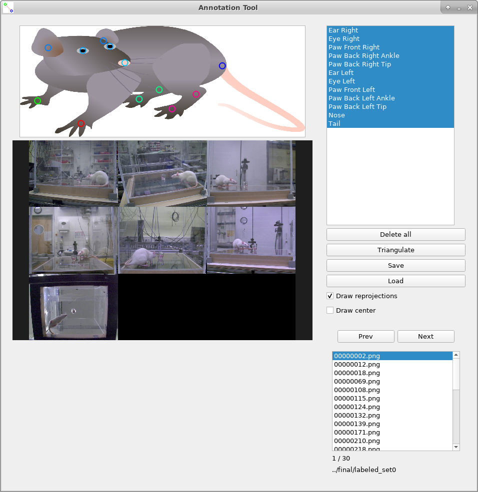

# Labeling Tool

The annotation tool is used for

- Making 2D annotations for keypoints
- Calculating the resulting 3D point hypothesis from 2D annotations given a camera calibration file
    

## Overview

- On its left hand side of the tool shows the example image on the top and in below one time step of the video data is shown
- Images recorded simultaneous by the cameras are shown in a tiled view
- On the right hand side of the tool various controls are offered:
    
    - Top box gives control over which keypoints are shown by selecting them, by default all keypoints are shown
    - 'Delete all': Discards all predicted keypoints for this frame (use this when predictions are too far off and correcting them would actually take longer than restartin from scratch)
    - 'Triangulate': Calculate 3D point hypothesis from given annotations.
    - 'Save': Store current annotations to 'anno.json'
    - 'Load': Load current annotations from 'anno.json'
    - 'Draw reprojections': Show projections of the 3D point hypothesis as 'x'
    - 'Draw center': Add lines indicating the exact location of a keypoint additionally to their ususal circular appearance.
    - Bottom box shows the currently shown frame and all other frames being part of this labeled_set

## Starting the tool

For starting the selection tool a model configuration file `{MODEL_CFG}` must be provided (so the tool knows which keypoint
are defined and how to show them) as well as an indication towards the data that should be shown `{DATA_PATH}`

    python label.py {MODEL_CFG} {DATA_PATH}
    
For example the largest part of the tutorials uses the rat model so
 
    {MODEL_CFG}=config/model_rat.cfg.json

Data path has to be chosen as path to the labeled set

    {DATA_PATH}=data/labeled_set0/
    
If you need to adapt the appearance of the Annotation tool towards your screen setting please see 'frame_size' in `config/viewer.cfg.json`.

If you need to deviate from the assumed default layout on how calibration files are located (`M.json` on path down wrt. `{DATA_PATH}`),
you can call label.py using the --calib_file argument, which specifies the path to the calibration file wrt the **path** of `{DATA_PATH}`.

The Tool assumes the file ending of frames to label is a priori known as defaults to 'png'. This setting can also be changed in `config/viewer.cfg.json`.

## Using the tool

- 'Mouse wheel': Zooming in and out of the left hand side frames
- 'Left mouse button', when **not on** any keypoint: Translating the frames shown left, right, up or down. (Ususally, used when zoomed in)
- 'Left mouse button', when **on** any keypoint: Moving keypoint around in a drag'n'drop fashion. Ususally, points are dragged from the example view and dropped on the recorded videos, but also refining positions of previously placed keypoints is possible.
- 'Right mouse button': Delete the annotation clicked on.
- 'Shift' + 'Right mouse button': Delete annotations from all views.
- 'Arrow right', ->: Next frame
- 'Arrow left', <-: Previous frame
- 't': Triangulate 2D annotations to 3D